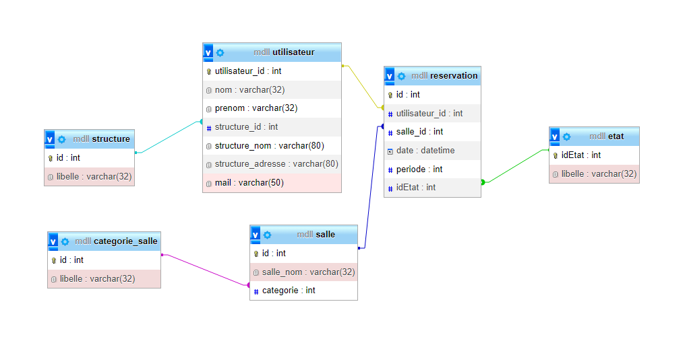

# Valres2
    <link href="https://stackpath.bootstrapcdn.com/bootstrap/4.3.1/css/bootstrap.min.css" rel="stylesheet"> 

### Presentation du projet
Ce projet est une continuité du projet valres de base qui permet la gestion des reservations des clients M2L.
Pour ce faire nous avons mit en place un site internet où les utilisateurs en fonction de leur statut auront des accès variés.

__Les grades:__
* **Administrateur** : personne chargée de maintenir à jour les informations relatives aux
utilisateurs et pouvant consulter à tout moment l’état des salles.
* **Secrétariat** : personne chargée de valider les réservations et pouvant réserver une salle et
consulter l’état des salles à tout moment.
* **Responsable** : personne effectuant les réservations des salles (état provisoire) et pouvant
consulter à tout moment l’état des salles.
* **Utilisateur** : personne pouvant consulter à tout moment les réservations des salles.

### Architecture MVC 
Pour la réalisation de ce projet avec mon camarade, nous avons utilisé la méthode MVC qui permet de structurer de la façon la plus conventionnel possible notre projet.

* Model → Contient les script qui permettent la liaison vers la BDD
* View → Permet de gérer tout la partie Front *(Affichage du site web)*
* Controller → Comme son nom l'indique controle / vérifier que les *données* entrées peuvent correctement être exploitées

__source :__
* [MVC en 5min](https://www.youtube.com/watch?v=gs-61l4Z32M&pp=ygUDTVZD)
* [MVC plus détailler](https://www.youtube.com/watch?v=HxhwAc7zzgE&pp=ygUDTVZD)

---
### Repartition du travail (Cahier des Charges)
__Partie Administration (Tduki) :__
* Gérer les accès : ajouter, supprimer, modifier l’accès pour une personne (Administrateur,
secrétariat...)
* Gérer la connexion et déconnexion des utilisateurs.
* Consulter les réservations.
* Générer le fichier xml des utilisateurs de début d’année.

__Partie Réservation (Medhi) :__
* Gérer les réservations : ajouter, supprimer une réservation.
* Confirmer ou annuler les réservations. (Passage de l’état « Provisoire » à « Confirmé » ou
« Annulé »)
* Consulter les salles disponibles.
* Générer le fichier xml des réservations validées d’une semaine.
---

### Base de projet
Durant la construction de **Valres2** nous avons put prendre certaine initative tel que :
* la modification de la Base de donnée, qui nous a permit de mieux optimiser et surtout répondre au besoin
de gestion des droits ainsi que pour vérifier l'etat d'une reservation.

Pour la réalisation de ce projet nous avons aussi mit en place des mesures tel que.